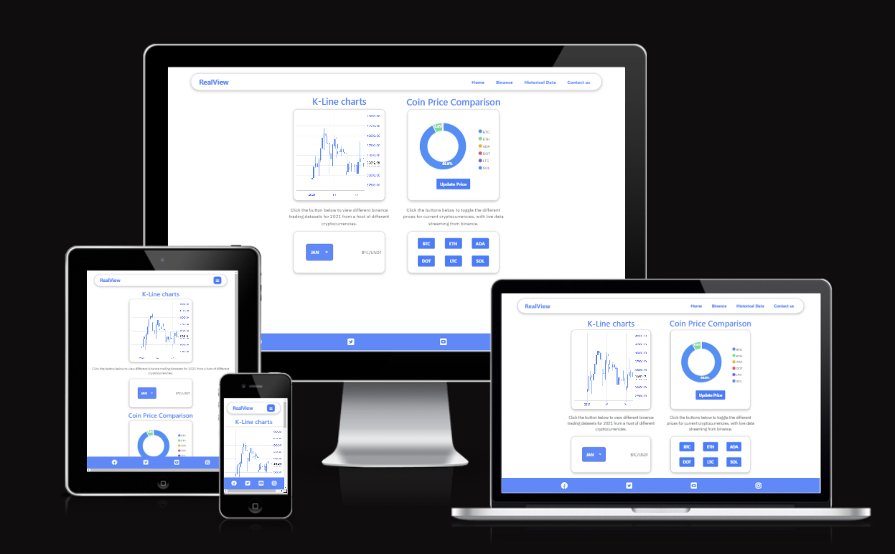
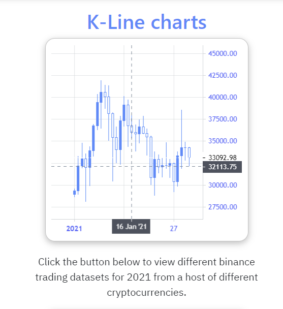
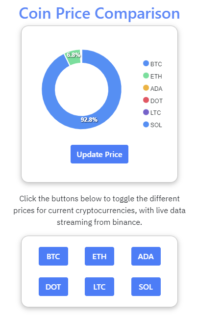
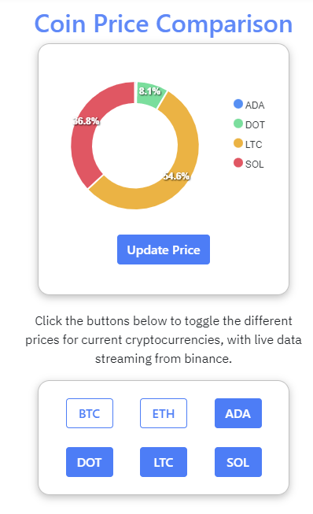

# **RealView**
A tool for visualizing real-time financial data from different sources.
[Website link here](https://mattmurnaghan.github.io/RealView/)

## **Learning outcomes**
* Learn how to capture real-time data from the Binance API
* Learn how to display data using javascript libraries
* Build a functional website to be able to display more than three cryptocurrency live prices on different time scales set by the user.
* Change the display type (line charts vs candlestick charts)
* Create a pie chart showing the price relationships between different currencies

## Site Layout:
---
This is a single-page site consisting of two main features:
* K-Line or candlestick chart viewing
* Donut chart presentation of live trade prices from Binance. 

## User Goals
---
This site is focused on demonstrating simple data manipulation techniques for those who already have an interest in cryptocurrency and finance. 

### First-time visitors
1. I want to see data easily displayed for some of the most popular cryptocurrencies.
2. I want to be able to choose which currencies are displayed and have live updates.
3. I want to be able to see the previous history of popular cryptocurrencies.

## User Journey
---
The user journey for this site is quite small, as it is focused mainly on demonstration and data manipulation.

On the desktop version of the site, no scrolling is required to see all of the site features.

### **Kline Chart**
To show off the historical data from the Binance website, I chose to use a package called lightweight charts. It was created by [trading view](https://www.tradingview.com/). The version that I employed was a free version of the software, but it served its purpose well enough to display the data that I was interested in.

Initially, I had planned to make use of the Binance API to stream live data into the chart, however, I found this to be very difficult to achieve without running a separate server. I decided to instead download some free CSV data from the Binance historical data resourses. 

Once I stored the data in the assets folder, I wrote an offline file called csv2json.js, which I used to parse the data as JSON and filter the information that I needed to match the schema accepted by the lightweight charts package.

the csv2Json file makes use of the npm fs libraries, allowing me to read and write data asynchronously. When running the csv2json file, a root_path variable is passed to a set of functions, pointing towards the directory where the CSV files are stored and writing back to the same directory with updated JSON files.

Following this, I intended to create a set of event listeners that would handle requests from the user and change the coin pair and time period displayed.

Unfortunately, I was unable to complete this feature, only getting to implement the January dataset for the BTC/USDT pair. But, with some further development, this feature is easily attainable.

Show below is a screenshot of the feature, demonstrating the lightweight charts candlestick tool. It allows for precise price analysis and the user's ability to zoom and scroll. It automatically re-sizes the scales at the size depending on the level of zoom applied.

||
|:--:|
| <strong>K-Line chart by Lightweight charts</strong>  |

### **Live Trade Price - Donut chart**
I chose to display some live trade info by streaming from the Binance sockets using the built-in javascript WebSocket class. I used two separate JS files, imported into index.JS (main) using ES6 module notation.

I implemented a BinanceSocketManager class in a separate JS file, [binance_socket.js](assets/js/binance_socket.js). 

The class has four properties:
* socket_addr
* name
* socket
* price_data

I originally had intended to use the price data property to return a price data payload to the main index.js file, but settled on making use of the sessionStorage property.

I chose to use session storage as I knew that the memory required by the payload was very small and was overwritten on every request of new data, so performance issues were not a problem. It also made accessing the data from the sockets very easy to do from the second integral file, [apexCharts.js](assets/js/apexCharts.js).

In the main file, 6 BinanceSocketManager objects are instantiated using the mentioned class. They are opened using the socket addresses provided as a static resource within the file.

An onmessage event is then called on each websocket using the monitorSocket() method, which updates the sessionstorage on every new message to the socket. 

Following this, a new instance of the Donut class is instantiated in the main JS file. This class makes use of the [apexCharts](https://apexcharts.com/) library.

One single donut class is invoked in the main, taking a static array of coin names as a parameter to the constructor. 

The series to be displayed is updated through the updateSeries() method, which is tied to the update price button with an event listener.

There are also a series of buttons underneath the donut chart, instructing the user to toggle on and off the coins that they are looking to review.

||
|:--:|
| <strong>Donut chart showing large price coins</strong>|

||
|:--:|
| <strong>Donut chart showing the toggle feature for viewing individual trade prices</strong>|

## **Node package manager (npm)**
I initially planned on using npm to manage some of my dependencies and packages for this project. 
Npm is an industry-standard technology required to install different node packages. Node packages are written in the Node environment built on the V8 Javascript runtime environment created by google.

## **Node Modules**
The list of node modules I used in this project is shown below:

* [fs promises](https://nodejs.org/dist/latest-v10.x/docs/api/fs.html)
    - For connecting to WebSockets and streaming data from the Binance API

I didn't use many as the code was predominantly client side, however, I did make use of the fs libraries for parsing the CSV data that I retrieved from the Binance servers.

## **The Binance API**
I used the Binance API to connect to their official WebSocket stream. This allowed me to capture live data about the Binance marketplace.
See the offical documentation [here](https://github.com/binance/binance-spot-api-docs/blob/master/web-socket-streams.md).

The main endpoint used to connect to the stream: 
- wss://stream.binance.com:9443

The stream outputs the data in the form of JSON objects using [ "key": value ] pairs:

### **Trade streams**

To read the data from the Bitcoin/USDT trade stream, you can connect using this stream:
- wss://stream.binance.com:9443/ws/btcusdt@trade

        {
            
            "e": "trade",           //Lists the type of data
            "E": 1657675597736,     //Lists the event time with a unix time-stamp
            "s": "BTCUSDT",         //Lists the currency pair being traded
            "t": 1458726751,        //Lists the trade ID
            "p": "19385.08000000",  //Lists the price of the trade
            "q": "0.01262000",      //Lists the quantity of the currency that was traded
            "b": 11550945399,       //Lists the buyer order ID
            "a": 11550945402,       //Lists the seller order ID
            "T": 1657675597735,     //Lists the time the trade took place
            "m": true,              //Is the buyer a market buyer?
            "M": true               //Ignore
        }

These JSON objects can be used to store data points and their relational aspects. In the above object, we have a currency pair,  a time that it took place and a price that it was traded at. this data can then be fed into a graphing tool to create a visual representation of the time/price relationship of the BTC/USDT pair.

### **Kline/Candlestick streams**

To read the data from the Bitcoin/USDT candlestick or kline stream, you can connect using this stream:
- wss://stream.binance.com:9443/ws/btcusdt@kline_5m

This will output a candlestick stream of trade data, including the opening price, closing price, peak price and lowest price.

        {
            "e": "kline",                   // Data type
            "E": 1657675754011,             // Event time
            "s": "BTCUSDT",                 // Symbol
            "k": {  
                "t": 1657675500000,         // Kline start time with unix time-stamp
                "T": 1657675799999,         // Kline close time with unix time-stamp
                "s": "BTCUSDT",             // Symbol
                "i": "5m",                  // Interval
                "f": 1458722581,            // First trade ID
                "L": 1458731181,            // Last trade ID
                "o": "19411.85000000",      // Open price
                "c": "19405.05000000",      // Close price
                "h": "19415.00000000",      // High price
                "l": "19378.37000000",      // Low price
                "v": "297.07434000",        // Base asset volume
                "n": 8601,                  // Number of trades
                "x": false,                 // Is this kline closed?
                "q": "5762128.25577910",    // Quote asset volume
                "V": "138.36981000",        // Taker buy base asset volume
                "Q": "2683904.79370620",    // Taker buy quote asset volume
                "B": "0"                    // Ignore
            }
        }

This kind of data is used to create candlestick charts, specifically used to carry out a detailed analysis of financial markets during trade hours over a given time interval.

## **References**

[Box shadows](https://www.youtube.com/watch?v=Yon4l3MUBGY)

[Dropdown burger menu](https://www.youtube.com/watch?v=pVpW0SPmN7k)

[binance API playlist](https://www.youtube.com/playlist?list=PLvzuUVysUFOuB1kJQ3S2G-nB7_nHhD7Ay)

[JSON to JSON Schema converter](https://www.liquid-technologies.com/online-json-to-schema-converter)

[parse csv files](https://bobbyhadz.com/blog/javascript-read-file-into-array#:~:text=Use%20the%20fs.,get%20an%20array%20of%20strings.)

[loop through object in javascript](https://flexiple.com/loop-through-object-javascript/)

[binance historical data](https://data.binance.vision/?prefix=data/spot/)

[splitting strings by specific characters](https://www.w3schools.com/jsref/jsref_split.asp#:~:text=The%20split()%20method%20splits,string%20is%20split%20between%20words.)

[declaring new javasscript objects](https://developer.mozilla.org/en-US/docs/Web/JavaScript/Guide/Working_with_Objects)

[reading files asynchronously in JS](https://stackoverflow.com/questions/40593875/using-filesystem-in-node-js-with-async-await)